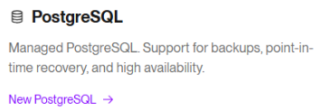
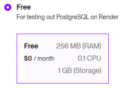
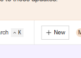

# Render free deployment

Visit the [Render](https://render.com) website and create an account

## Creating a PostegrSQL database

To start click on postgreSQL :



Choose a name for your dataBase :


Then replace the required fields with your own informations.

Tick free :



And finally creat your dataBase :


## Creating a new web service project

Click on new in the top right-hand corner :



Get the url of your project from github like this one :

**https//github.com/yourName/yourProject.git**

In render copy the URL of your project in the section Public Git Repository :


Then replace the required fields with your own informations.

- for the field build command put $ npm install; npm run build

- for the field start command put $ node build/ace migration: run --force && cd build && npm run start

Retrieve the informations from your previously created database, such as `Hostname`, `Port`, `database name`, `userName` and `Password`.

Use your project's `.env` file to fill in the environment variables on render.
Don't forget to check the **node version**, switch **node_env to production** and modify **HOST** and **PORT** like this :

```config
PORT=443
HOST=0.0.0.0
NODE_ENV=production
```

**Warning** as part of an adonis JS 6 project, you need to move the devdependencies to dependencies in the package.json file.

And now you can deploy your project
